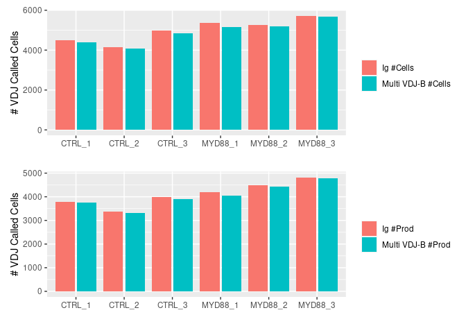

## **Result Preview**


```r
library(tidyverse)
library(patchwork)

df <- tribble(
  ~"Ig #Cells", ~"Ig #Prod", ~"Multi VDJ-B #Cells", ~"Multi VDJ-B #Prod", 
  4504,	3785, 4408, 3741,
  4164,	3359, 4069, 3303,
  4968,	3976, 4850, 3900,
  5365,	4209, 5140, 4060,
  5248,	4477, 5179, 4428,
  5719,	4825, 5662, 4792)

df['sample_name'] <- 
  c('CTRL_1', 'CTRL_2', 'CTRL_3', 
    'MYD88_1', 'MYD88_2', 'MYD88_3')


plot_df <- 
  df %>% pivot_longer(-c(sample_name))

p1 <- plot_df %>% 
  filter(grepl('Cells', name)) %>% 
  ggplot() + 
    geom_col(aes(x = sample_name, y = value, fill=name), 
             position = position_dodge2()) + 
  xlab('') + ylab('# VDJ Called Cells') + 
  theme(legend.title = element_blank())

p2 <- plot_df %>% 
  filter(grepl('Prod', name)) %>% 
  ggplot() + 
    geom_col(aes(x = sample_name, y = value, fill=name), 
             position = position_dodge2()) + 
  xlab('') + ylab('# VDJ Called Cells') + 
  theme(legend.title = element_blank())

p1 / p2 
```

<!-- -->

**As seen above, `cellranger multi` returns very consistent results compared to the previously used `cellranger vdj` command**

## **Data Loading**###


```r
library(magrittr)

{
  base_dir <- '/home/x1/Documents/Weill_Cornell/Spring_Project/storage/cell_barcodes/'
  
  ctrl_1_unfiltered_count_file <-  paste0(base_dir, 'ctrl_1_unfiltered_count_barcodes.tsv')
  ctrl_2_unfiltered_count_file <-  paste0(base_dir, 'ctrl_2_unfiltered_count_barcodes.tsv')
  ctrl_3_unfiltered_count_file <-  paste0(base_dir, 'ctrl_3_unfiltered_count_barcodes.tsv')
  myd88_1_unfiltered_count_file <- paste0(base_dir, 'myd88_1_unfiltered_count_barcodes.tsv')
  myd88_2_unfiltered_count_file <- paste0(base_dir, 'myd88_2_unfiltered_count_barcodes.tsv')
  myd88_3_unfiltered_count_file <- paste0(base_dir, 'myd88_3_unfiltered_count_barcodes.tsv')
  
  ctrl_1_count_file <-  paste0(base_dir, 'ctrl_1_count_barcodes.tsv')
  ctrl_2_count_file <-  paste0(base_dir, 'ctrl_2_count_barcodes.tsv')
  ctrl_3_count_file <-  paste0(base_dir, 'ctrl_3_count_barcodes.tsv')
  myd88_1_count_file <- paste0(base_dir, 'myd88_1_count_barcodes.tsv')
  myd88_2_count_file <- paste0(base_dir, 'myd88_2_count_barcodes.tsv')
  myd88_3_count_file <- paste0(base_dir, 'myd88_3_count_barcodes.tsv')
  
  ctrl_1_vdj_file <-  paste0(base_dir, 'ctrl_1_vdj_barcodes.json')
  ctrl_2_vdj_file <-  paste0(base_dir, 'ctrl_2_vdj_barcodes.json')
  ctrl_3_vdj_file <-  paste0(base_dir, 'ctrl_3_vdj_barcodes.json')
  myd88_1_vdj_file <- paste0(base_dir, 'myd88_1_vdj_barcodes.json')
  myd88_2_vdj_file <- paste0(base_dir, 'myd88_2_vdj_barcodes.json')
  myd88_3_vdj_file <- paste0(base_dir, 'myd88_3_vdj_barcodes.json')
  
  ctrl_1_multi_vdj_file <-  paste0(base_dir, 'ctrl_1_multi_vdj_cell_barcodes.json')
  ctrl_2_multi_vdj_file <-  paste0(base_dir, 'ctrl_2_multi_vdj_cell_barcodes.json')
  ctrl_3_multi_vdj_file <-  paste0(base_dir, 'ctrl_3_multi_vdj_cell_barcodes.json')
  myd88_1_multi_vdj_file <- paste0(base_dir, 'myd88_1_multi_vdj_cell_barcodes.json')
  myd88_2_multi_vdj_file <- paste0(base_dir, 'myd88_2_multi_vdj_cell_barcodes.json')
  myd88_3_multi_vdj_file <- paste0(base_dir, 'myd88_3_multi_vdj_cell_barcodes.json')
  
  ctrl_1_multi_count_file <-  paste0(base_dir, 'ctrl_1_multi_count_barcodes.tsv')
  ctrl_2_multi_count_file <-  paste0(base_dir, 'ctrl_2_multi_count_barcodes.tsv')
  ctrl_3_multi_count_file <-  paste0(base_dir, 'ctrl_3_multi_count_barcodes.tsv')
  myd88_1_multi_count_file <- paste0(base_dir, 'myd88_1_multi_count_barcodes.tsv')
  myd88_2_multi_count_file <- paste0(base_dir, 'myd88_2_multi_count_barcodes.tsv')
  myd88_3_multi_count_file <- paste0(base_dir, 'myd88_3_multi_count_barcodes.tsv')
}
```


## **Sample Ctrl_1 Validation**


```r
ctrl_1_full_barcodes <- read.csv(ctrl_1_unfiltered_count_file) %>% unlist()
ctrl_1_cell_barcodes <- read.csv(ctrl_1_count_file) %>% unlist()
ctrl_1_vdj_barcodes <- rjson::fromJSON(file=ctrl_1_vdj_file) %>% unlist()
ctrl_1_multi_vdj_barcodes <- rjson::fromJSON(file=ctrl_1_multi_vdj_file) %>% unlist()
ctrl_1_multi_cell_barcodes <- read.csv(ctrl_1_multi_count_file) %>% unlist()
```

### **Total 10X Cell Barcode Count**


```r
cat('Number of unfiltered barcodes: ', length(ctrl_1_full_barcodes), '\n')
```

```
Number of unfiltered barcodes:  737279 
```

```r
cat('Number of cell-associated barcodes: ', length(ctrl_1_cell_barcodes))
```

```
Number of cell-associated barcodes:  9927
```

### **Cellranger Count Called Cell Barcodes**


```r
if (length(setdiff(ctrl_1_cell_barcodes, ctrl_1_full_barcodes)) == 0) {
  cat('All cell-associated barcodes found within unfiltered barcodes\n')
}
```

```
All cell-associated barcodes found within unfiltered barcodes
```


### **Cellranger VDJ vs Cellranger Muli Called Cell Barcodes**


```r
cat('Number of vdj called cells: ', length(ctrl_1_vdj_barcodes), '\n')
```

```
Number of vdj called cells:  4504 
```

```r
cat('Number of vdj called cells (with multi): ', length(ctrl_1_multi_vdj_barcodes))
```

```
Number of vdj called cells (with multi):  4408
```

### **Cellranger Count vs Cellranger VDJ Called Cell Barcodes**


```r
cat('Number of vdj called cells from cellranger vdj, filtered by cellranger count called cells: ', length(intersect(ctrl_1_cell_barcodes, ctrl_1_vdj_barcodes)))
```

```
Number of vdj called cells from cellranger vdj, filtered by cellranger count called cells:  4408
```

**First we see that the cell barcodes returned from `cellranger multi` are the exact same barcodes returned from `cellranger count`**


```r
ctrl_1_multi_cell_barcodes <- sort(ctrl_1_multi_cell_barcodes)
ctrl_1_cell_barcodes <- sort(ctrl_1_cell_barcodes)

all(ctrl_1_multi_cell_barcodes == ctrl_1_cell_barcodes)
```

```
[1] TRUE
```
**Now we see that we can achieve the same result as `cellranger multi`  by filtering 
cell barcodes from `cellranger vdj` to only cell barcodes called with `cellranger count`**


```r
ctrl_1_multi_vdj_barcodes <- sort(ctrl_1_multi_vdj_barcodes)

manual_filtered_barcodes <- intersect(ctrl_1_cell_barcodes, ctrl_1_vdj_barcodes)
manual_filtered_barcodes <- sort(manual_filtered_barcodes)

all(ctrl_1_multi_vdj_barcodes == manual_filtered_barcodes)
```

```
[1] TRUE
```


## **Sample Ctrl_2 Validation**


```r
ctrl_2_full_barcodes <- read.csv(ctrl_2_unfiltered_count_file) %>% unlist()
ctrl_2_cell_barcodes <- read.csv(ctrl_2_count_file) %>% unlist()
ctrl_2_vdj_barcodes <- rjson::fromJSON(file=ctrl_2_vdj_file) %>% unlist()
ctrl_2_multi_vdj_barcodes <- rjson::fromJSON(file=ctrl_2_multi_vdj_file) %>% unlist()
ctrl_2_multi_cell_barcodes <- read.csv(ctrl_2_multi_count_file) %>% unlist()
```

### **Total 10X Cell Barcode Count**


```r
cat('Number of unfiltered barcodes: ', length(ctrl_2_full_barcodes), '\n')
```

```
Number of unfiltered barcodes:  737279 
```

```r
cat('Number of cell-associated barcodes: ', length(ctrl_2_cell_barcodes))
```

```
Number of cell-associated barcodes:  9260
```

### **Cellranger Count Called Cell Barcodes**


```r
if (length(setdiff(ctrl_2_cell_barcodes, ctrl_2_full_barcodes)) == 0) {
  cat('All cell-associated barcodes found within unfiltered barcodes\n')
}
```

```
All cell-associated barcodes found within unfiltered barcodes
```


### **Cellranger VDJ vs Cellranger Muli Called Cell Barcodes**


```r
cat('Number of vdj called cells: ', length(ctrl_2_vdj_barcodes), '\n')
```

```
Number of vdj called cells:  4164 
```

```r
cat('Number of vdj called cells (with multi): ', length(ctrl_2_multi_vdj_barcodes))
```

```
Number of vdj called cells (with multi):  4069
```

### **Cellranger Count vs Cellranger VDJ Called Cell Barcodes**


```r
cat('Number of vdj called cells from cellranger vdj, filtered by cellranger count called cells: ', length(intersect(ctrl_2_cell_barcodes, ctrl_2_vdj_barcodes)))
```

```
Number of vdj called cells from cellranger vdj, filtered by cellranger count called cells:  4068
```

**First we see that the cell barcodes returned from `cellranger multi` are the 
exact same barcodes returned from `cellranger count`


```r
ctrl_2_multi_cell_barcodes <- sort(ctrl_2_multi_cell_barcodes)
ctrl_2_cell_barcodes <- sort(ctrl_2_cell_barcodes)

all(ctrl_2_multi_cell_barcodes == ctrl_2_cell_barcodes)
```

```
[1] TRUE
```
**Now we see that we can achieve the same result as `cellranger multi`  by filtering 
cell barcodes from `cellranger vdj` to only cell barcodes called with `cellranger count`**


```r
ctrl_2_multi_vdj_barcodes <- sort(ctrl_2_multi_vdj_barcodes)

manual_filtered_barcodes <- intersect(ctrl_2_cell_barcodes, ctrl_2_vdj_barcodes)
manual_filtered_barcodes <- sort(manual_filtered_barcodes)

length(ctrl_2_multi_vdj_barcodes)
```

```
[1] 4069
```

```r
length(manual_filtered_barcodes)
```

```
[1] 4068
```

```r
setdiff(ctrl_2_multi_vdj_barcodes, manual_filtered_barcodes)
```

```
[1] "AAACCTGAGAAACGAG-1"
```


We see for sample **Ctrl_2** that there is a difference in one cell barcode between 
manually filtering the barcodes and what is returned by `cellranger multi`


## **Sample Ctrl_3 Validation**


```r
ctrl_3_full_barcodes <- read.csv(ctrl_3_unfiltered_count_file) %>% unlist()
ctrl_3_cell_barcodes <- read.csv(ctrl_3_count_file) %>% unlist()
ctrl_3_vdj_barcodes <- rjson::fromJSON(file=ctrl_3_vdj_file) %>% unlist()
ctrl_3_multi_vdj_barcodes <- rjson::fromJSON(file=ctrl_3_multi_vdj_file) %>% unlist()
ctrl_3_multi_cell_barcodes <- read.csv(ctrl_3_multi_count_file) %>% unlist()
```

### **Total 10X Cell Barcode Count**


```r
cat('Number of unfiltered barcodes: ', length(ctrl_3_full_barcodes), '\n')
```

```
Number of unfiltered barcodes:  737279 
```

```r
cat('Number of cell-associated barcodes: ', length(ctrl_3_cell_barcodes))
```

```
Number of cell-associated barcodes:  10102
```

### **Cellranger Count Called Cell Barcodes**


```r
if (length(setdiff(ctrl_3_cell_barcodes, ctrl_3_full_barcodes)) == 0) {
  cat('All cell-associated barcodes found within unfiltered barcodes\n')
}
```

```
All cell-associated barcodes found within unfiltered barcodes
```


### **Cellranger VDJ vs Cellranger Muli Called Cell Barcodes**


```r
cat('Number of vdj called cells: ', length(ctrl_3_vdj_barcodes), '\n')
```

```
Number of vdj called cells:  4968 
```

```r
cat('Number of vdj called cells (with multi): ', length(ctrl_3_multi_vdj_barcodes))
```

```
Number of vdj called cells (with multi):  4850
```

### **Cellranger Count vs Cellranger VDJ Called Cell Barcodes**


```r
cat('Number of vdj called cells from cellranger vdj, filtered by cellranger count called cells: ', length(intersect(ctrl_3_cell_barcodes, ctrl_3_vdj_barcodes)))
```

```
Number of vdj called cells from cellranger vdj, filtered by cellranger count called cells:  4849
```

**First we see that the cell barcodes returned from `cellranger multi` are the 
exact same barcodes returned from `cellranger count`


```r
ctrl_3_multi_cell_barcodes <- sort(ctrl_3_multi_cell_barcodes)
ctrl_3_cell_barcodes <- sort(ctrl_3_cell_barcodes)

all(ctrl_3_multi_cell_barcodes == ctrl_3_cell_barcodes)
```

```
[1] TRUE
```
**Now we see that we can achieve the same result as `cellranger multi`  by filtering 
cell barcodes from `cellranger vdj` to only cell barcodes called with `cellranger count`**


```r
ctrl_3_multi_vdj_barcodes <- sort(ctrl_3_multi_vdj_barcodes)

manual_filtered_barcodes <- intersect(ctrl_3_cell_barcodes, ctrl_3_vdj_barcodes)
manual_filtered_barcodes <- sort(manual_filtered_barcodes)

length(ctrl_3_multi_vdj_barcodes)
```

```
[1] 4850
```

```r
length(manual_filtered_barcodes)
```

```
[1] 4849
```

```r
setdiff(ctrl_3_multi_vdj_barcodes, manual_filtered_barcodes)
```

```
[1] "AAACCTGAGACAAGCC-1"
```


We see for sample **Ctrl_3** that there is a difference in one cell barcode between 
manually filtering the barcodes and what is returned by `cellranger multi`


## **Sample MYD88_1 Validation**


```r
myd88_1_full_barcodes <- read.csv(myd88_1_unfiltered_count_file) %>% unlist()
myd88_1_cell_barcodes <- read.csv(myd88_1_count_file) %>% unlist()
myd88_1_vdj_barcodes <- rjson::fromJSON(file=myd88_1_vdj_file) %>% unlist()
myd88_1_multi_vdj_barcodes <- rjson::fromJSON(file=myd88_1_multi_vdj_file) %>% unlist()
myd88_1_multi_cell_barcodes <- read.csv(myd88_1_multi_count_file) %>% unlist()
```

### **Total 10X Cell Barcode Count**


```r
cat('Number of unfiltered barcodes: ', length(myd88_1_full_barcodes), '\n')
```

```
Number of unfiltered barcodes:  737279 
```

```r
cat('Number of cell-associated barcodes: ', length(myd88_1_cell_barcodes))
```

```
Number of cell-associated barcodes:  9395
```

### **Cellranger Count Called Cell Barcodes**


```r
if (length(setdiff(myd88_1_cell_barcodes, myd88_1_full_barcodes)) == 0) {
  cat('All cell-associated barcodes found within unfiltered barcodes\n')
}
```

```
All cell-associated barcodes found within unfiltered barcodes
```


### **Cellranger VDJ vs Cellranger Muli Called Cell Barcodes**


```r
cat('Number of vdj called cells: ', length(myd88_1_vdj_barcodes), '\n')
```

```
Number of vdj called cells:  5365 
```

```r
cat('Number of vdj called cells (with multi): ', length(myd88_1_multi_vdj_barcodes))
```

```
Number of vdj called cells (with multi):  5140
```

### **Cellranger Count vs Cellranger VDJ Called Cell Barcodes**


```r
cat('Number of vdj called cells from cellranger vdj, filtered by cellranger count called cells: ', length(intersect(myd88_1_cell_barcodes, myd88_1_vdj_barcodes)))
```

```
Number of vdj called cells from cellranger vdj, filtered by cellranger count called cells:  5139
```

**First we see that the cell barcodes returned from `cellranger multi` are the 
exact same barcodes returned from `cellranger count`


```r
myd88_1_multi_cell_barcodes <- sort(myd88_1_multi_cell_barcodes)
myd88_1_cell_barcodes <- sort(myd88_1_cell_barcodes)

all(myd88_1_multi_cell_barcodes == myd88_1_cell_barcodes)
```

```
[1] TRUE
```
**Now we see that we can achieve the same result as `cellranger multi`  by filtering 
cell barcodes from `cellranger vdj` to only cell barcodes called with `cellranger count`**


```r
myd88_1_multi_vdj_barcodes <- sort(myd88_1_multi_vdj_barcodes)

manual_filtered_barcodes <- intersect(myd88_1_cell_barcodes, myd88_1_vdj_barcodes)
manual_filtered_barcodes <- sort(manual_filtered_barcodes)

length(myd88_1_multi_vdj_barcodes)
```

```
[1] 5140
```

```r
length(manual_filtered_barcodes)
```

```
[1] 5139
```

```r
setdiff(myd88_1_multi_vdj_barcodes, manual_filtered_barcodes)
```

```
[1] "AAACCTGAGCGCTTAT-1"
```


We see for sample **MYD88_1** that there is a difference in one cell barcode between 
manually filtering the barcodes and what is returned by `cellranger multi`


## **Sample MYD88_2 Validation**


```r
myd88_2_full_barcodes <- read.csv(myd88_2_unfiltered_count_file) %>% unlist()
myd88_2_cell_barcodes <- read.csv(myd88_2_count_file) %>% unlist()
myd88_2_vdj_barcodes <- rjson::fromJSON(file=myd88_2_vdj_file) %>% unlist()
myd88_2_multi_vdj_barcodes <- rjson::fromJSON(file=myd88_2_multi_vdj_file) %>% unlist()
myd88_2_multi_cell_barcodes <- read.csv(myd88_2_multi_count_file) %>% unlist()
```

### **Total 10X Cell Barcode Count**


```r
cat('Number of unfiltered barcodes: ', length(myd88_2_full_barcodes), '\n')
```

```
Number of unfiltered barcodes:  737279 
```

```r
cat('Number of cell-associated barcodes: ', length(myd88_2_cell_barcodes))
```

```
Number of cell-associated barcodes:  12699
```

### **Cellranger Count Called Cell Barcodes**


```r
if (length(setdiff(myd88_2_cell_barcodes, myd88_2_full_barcodes)) == 0) {
  cat('All cell-associated barcodes found within unfiltered barcodes\n')
}
```

```
All cell-associated barcodes found within unfiltered barcodes
```


### **Cellranger VDJ vs Cellranger Muli Called Cell Barcodes**


```r
cat('Number of vdj called cells: ', length(myd88_2_vdj_barcodes), '\n')
```

```
Number of vdj called cells:  5248 
```

```r
cat('Number of vdj called cells (with multi): ', length(myd88_2_multi_vdj_barcodes))
```

```
Number of vdj called cells (with multi):  5179
```

### **Cellranger Count vs Cellranger VDJ Called Cell Barcodes**


```r
cat('Number of vdj called cells from cellranger vdj, filtered by cellranger count called cells: ', length(intersect(myd88_2_cell_barcodes, myd88_2_vdj_barcodes)))
```

```
Number of vdj called cells from cellranger vdj, filtered by cellranger count called cells:  5179
```

**First we see that the cell barcodes returned from `cellranger multi` are the 
exact same barcodes returned from `cellranger count`


```r
myd88_2_multi_cell_barcodes <- sort(myd88_2_multi_cell_barcodes)
myd88_2_cell_barcodes <- sort(myd88_2_cell_barcodes)

all(myd88_2_multi_cell_barcodes == myd88_2_cell_barcodes)
```

```
[1] TRUE
```
**Now we see that we can achieve the same result as `cellranger multi`  by filtering 
cell barcodes from `cellranger vdj` to only cell barcodes called with `cellranger count`**


```r
myd88_2_multi_vdj_barcodes <- sort(myd88_2_multi_vdj_barcodes)

manual_filtered_barcodes <- intersect(myd88_2_cell_barcodes, myd88_2_vdj_barcodes)
manual_filtered_barcodes <- sort(manual_filtered_barcodes)

length(myd88_2_multi_vdj_barcodes)
```

```
[1] 5179
```

```r
length(manual_filtered_barcodes)
```

```
[1] 5179
```

```r
setdiff(myd88_2_multi_vdj_barcodes, manual_filtered_barcodes)
```

```
character(0)
```


We see for sample **MYD88_1** that there is no difference in barcodes between 
manually filtering the barcodes and what is returned by `cellranger multi`

## **Sample MYD88_3 Validation**


```r
myd88_3_full_barcodes <- read.csv(myd88_3_unfiltered_count_file) %>% unlist()
myd88_3_cell_barcodes <- read.csv(myd88_3_count_file) %>% unlist()
myd88_3_vdj_barcodes <- rjson::fromJSON(file=myd88_3_vdj_file) %>% unlist()
myd88_3_multi_vdj_barcodes <- rjson::fromJSON(file=myd88_3_multi_vdj_file) %>% unlist()
myd88_3_multi_cell_barcodes <- read.csv(myd88_3_multi_count_file) %>% unlist()
```

### **Total 10X Cell Barcode Count**


```r
cat('Number of unfiltered barcodes: ', length(myd88_3_full_barcodes), '\n')
```

```
Number of unfiltered barcodes:  737279 
```

```r
cat('Number of cell-associated barcodes: ', length(myd88_3_cell_barcodes))
```

```
Number of cell-associated barcodes:  11295
```

### **Cellranger Count Called Cell Barcodes**


```r
if (length(setdiff(myd88_3_cell_barcodes, myd88_3_full_barcodes)) == 0) {
  cat('All cell-associated barcodes found within unfiltered barcodes\n')
}
```

```
All cell-associated barcodes found within unfiltered barcodes
```


### **Cellranger VDJ vs Cellranger Muli Called Cell Barcodes**


```r
cat('Number of vdj called cells: ', length(myd88_3_vdj_barcodes), '\n')
```

```
Number of vdj called cells:  5719 
```

```r
cat('Number of vdj called cells (with multi): ', length(myd88_3_multi_vdj_barcodes))
```

```
Number of vdj called cells (with multi):  5662
```

### **Cellranger Count vs Cellranger VDJ Called Cell Barcodes**


```r
cat('Number of vdj called cells from cellranger vdj, filtered by cellranger count called cells: ', length(intersect(myd88_3_cell_barcodes, myd88_3_vdj_barcodes)))
```

```
Number of vdj called cells from cellranger vdj, filtered by cellranger count called cells:  5660
```

**First we see that the cell barcodes returned from `cellranger multi` are the 
exact same barcodes returned from `cellranger count`


```r
myd88_3_multi_cell_barcodes <- sort(myd88_3_multi_cell_barcodes)
myd88_3_cell_barcodes <- sort(myd88_3_cell_barcodes)

all(myd88_3_multi_cell_barcodes == myd88_3_cell_barcodes)
```

```
[1] TRUE
```
**Now we see that we can achieve the same result as `cellranger multi`  by filtering 
cell barcodes from `cellranger vdj` to only cell barcodes called with `cellranger count`**


```r
myd88_3_multi_vdj_barcodes <- sort(myd88_3_multi_vdj_barcodes)

manual_filtered_barcodes <- intersect(myd88_3_cell_barcodes, myd88_3_vdj_barcodes)
manual_filtered_barcodes <- sort(manual_filtered_barcodes)

length(myd88_3_multi_vdj_barcodes)
```

```
[1] 5662
```

```r
length(manual_filtered_barcodes)
```

```
[1] 5660
```

```r
setdiff(myd88_3_multi_vdj_barcodes, manual_filtered_barcodes)
```

```
[1] "AAACCTGAGACAGGCT-1" "AGGGTGACAGATCCAT-1"
```


We see for sample **MYD88_3** that there is a 2  cell barcode difference between 
manually filtering the barcodes and what is returned by `cellranger multi`


## **Conclusion**

From the above report, I do not see a large enough difference in the outputs to 
recommend any concern. Most of the time it seems that `cellranger multi` is 
returning 1-2 MORE cells, as opposed to possible output clipping.


