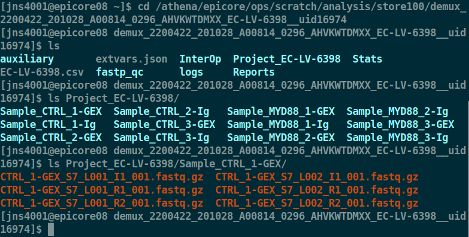

# **CellRanger multi pipeline**

For the fulfillment of independent research credit by **Jake Sauter**

[Slideshow Presentation](Presentation/Cellranger_Multi_Pipeline.pdf)

* [Introduction](#Introduction)
* [Interactive Server](#Interactive-Server)
* [Development Dataset](#Development-Dataset)
* [Cellranger Commands](#Cellranger-Commands)
    - [Cellranger Count](#Cellranger-Count)
    - [Cellranger VDJ](#Cellranger-VDJ)
    - [Cellranger Multi](#Cellranger-Multi)   
* [Cellranger Multi Validation](#Cellranger-Multi-Validation)
    - [Single-Cell Barcode Comparison](#Single-Cell-Barcode-Comparison)
* [Automating Cellranger Multi](Automating-Cellranger-Multi)
    - [Assumptions](#Assumptions)
    - [Identifying Paired Assays](#Identifying-Paired-Assays)
    - [Parsing Flowcell Design](#Parsing-Flowcell-Design)
    - [Retrieving Sample FastQ Files](#Retrieving-Sample-FastQ-Files)
    - [Forming Cellranger Multi Command](#Forming-Cellranger-Multi-Command)
* [Sequencing Monitor](#Sequencing-Monitor)

## **Introduction**

[Cellranger Multi](https://support.10xgenomics.com/single-cell-vdj/software/pipelines/latest/using/multi) is a software pipeline implemented by 10X genomics for processing parallel single-cell assays performed on transcripts or features originating from the same initial population of cells.

Particularly this has shown to be useful for [10X's Single-Cell Immune Profiling assays](https://support.10xgenomics.com/single-cell-vdj/software/pipelines/latest/what-is-cell-ranger) (Single Cell V(D)J + 5′ Gene Expression + Feature Barcode Technology) in which V(D)J transcripts and clonotypes for T and B cells, 5' gene expression and cell surface proteins or antigen specificity can all be assessed **for the same cell**.


## **Interactive Server**

In order to develop and test the work done for this project, the
`epicore08.pbtech` interactive server was used. Below are instructions of how to access this interactive server, where `$CWID` is the user's assigned account name on the system.

``` {.bash}
ssh $CWID@pascal.med.cornell.edu
```

``` {.bash}
ssh epicore08.pbtech
```

Local scratch workspace was used during processing steps on `epicore08.pbtech` at the following location:

``` {.bash}
/scratch001/$USER
```

## **Development Dataset**

Six samples were used while developing this project, consisting of 5' gene expression and VDJ assays for each sample. The original `FastQ` files for the project can be found on the `Athena` file server: 

``` {.bash}
/athena/epicore/ops/scratch/analysis/store100/demux_2200422_201028_A00814_0296_AHVKWTDMXX_EC-LV-6398__uid16974/Project_EC-LV-6398
```

## **Cellranger Commands**

Prior to the release of `cellranger mutli`,  in order to process V(D)J T-cell and B-cell repetoires as well as transcriptome-wide gene counts, the user had to run `cellranger count` on the transcriptome-wide library, followed by `cellranger vdj` on the TCR and BCR enriched libraries. Below we see the previously used commands for samples `CTRL_1-GEX` and `CTRL_1-Ig`.

### **Cellranger Count**

```bash
/opt/cellranger-5.0.0/bin/cellranger count \
    --id=CTRL_1-GEX \
    --fastqs=/athena/epicore/ops/scratch/analysis/store100/demux_2200422_201028_A00814_0296_AHVKWTDMXX_EC-LV-6398__uid16974/Project_EC-LV-6398/Sample_CTRL_1-GEX \
    --transcriptome=/athena/epicore/ops/scratch/genomes/indices/Mus_musculus/refdata-gex-mm10-2020-A \
    --sample=CTRL_1-GEX --description=Sample_CTRL_1-gex --disable-ui --localcores=32 --localmem=256 > CTRL_1-gex_run_log.txt 2>&1

```

### **Cellranger VDJ**

```bash
/opt/cellranger-5.0.0/bin/cellranger vdj \
    --id=CTRL_1-Ig \
    --fastqs=/athena/epicore/ops/scratch/analysis/store100/demux_2200422_201028_A00814_0296_AHVKWTDMXX_EC-LV-6398__uid16974/Project_EC-LV-6398/Sample_CTRL_1-Ig \
    --reference=/athena/epicore/ops/scratch/genomes/indices/Mus_musculus/refdata-cellranger-vdj-GRCm38-alts-ensembl-5.0.0 \
    --sample=CTRL_1-Ig --description=Sample_CTRL_1-Ig --disable-ui > CTRL_1-Ig_vdj_run_log.txt 2>&1
```


### **Cellranger Multi**

In order to run `cellranger multi` to perform both VDJ and Gene Expression analysis on the same sample, we first must generate a `cellranger mutli` specific configuration CSV file. This configuration
file instructs `cellranger multi` which references to use, which 
assays we have performed, and where the `FastQ` files for these
assays can be located on the local filesystem. An example of this
CSV file can be seen below 


|    |         |      |         |
|-----------------|--------------------------------------------------------------------------------|------|---------------|
| [gene-expression] | | | 
|reference        |/athena/epicore/ops/scratch/genomes/indices/Mus_musculus/refdata-gex-mm10-2020-A|      |               |
|[vdj]            |                                                                                |      |               |
|reference        |/athena/epicore/ops/scratch/genomes/indices/Mus_musculus/refdata-gex-mm10-2020-A|      |               |
|fastq_id         |fastqs                                                                          |lanes |feature_types  |
|CTRL_1-GEX       | /athena/epicore/ops/scratch/analysis/store100/demux_2200422_201028_A00814_0296_AHVKWTDMXX_EC-LV-6398__uid16974/Project_EC-LV-6398/Sample_CTRL_1-GEX                                                             |      |gene expression|
|CTRL_1-Ig        |/athena/epicore/ops/scratch/analysis/store100/demux_2200422_201028_A00814_0296_AHVKWTDMXX_EC-LV-6398__uid16974/Project_EC-LV-6398/Sample_CTRL_1-Ig                                                              |      |vdj            |


Once we have generated this configuration CSV, we can run `cellranger multi` the following way.

```bash
cellranger multi --id=CTRL_1-Ig_Gex \
    --csv=cellranger_multi_config.csv \
    --disable-ui > cellranger_ctrl_1_multi_output.txt 2>&1
```

## **Cellranger Multi Validation**

In order to ensure that `cellranger multi` produced similar results to the `cellranger count` and `cellranger vdj` pipelines currently used in Epicore analyses, I have ran the prior mentioned samples through both pipelines, and was able to directly access the 10X single-cell barcodes. 

**Script containing all commands**: [cellranger_multi_validation.sh](Bash/cellranger_multi_validation.sh)

Firstly, viewing the output directory of `cellranger count`, we can see that the **outs** directory is contained directly in the command output. 

```bash
/scratch001/jns4001/overnight_vdj_runs/CTRL_1-GEX
[jns4001@epicore08 CTRL_1-GEX]$ ls
_cmdline            _filelist    _invocation  _log        outs   SC_RNA_COUNTER_CS  _tags       _uuid     _versions
CTRL_1-GEX.mri.tgz  _finalstate  _jobmode     _mrosource  _perf  _sitecheck         _timestamp  _vdrkill
```
Further inspecting this output directory, we can see that the `outs/` directory contains the `filtered_feature_bc_matrix` directory, which contains the feature x barcode matrix of the analysis, as well as a `barcodes.tsv` file with contains only the barcodes in the assay that contained cells.
Analysis-results

``` bash
[jns4001@epicore08 CTRL_1-GEX]$ ls outs/filtered_feature_bc_matrix
barcodes.tsv  features.tsv  matrix.mtx
[jns4001@epicore08 CTRL_1-GEX]$ head -n 10 outs/filtered_feature_bc_matrix/barcodes.tsv 
AAACCTGAGCTAGTGG-1
AAACCTGAGCTGTTCA-1
AAACCTGAGGAGTTGC-1
AAACCTGAGTTTGCGT-1
AAACCTGCAATCTGCA-1
AAACCTGCAATGGAAT-1
AAACCTGCACCAGATT-1
AAACCTGCACGAAAGC-1
AAACCTGCACTCGACG-1
AAACCTGCAGTACACT-1
```

Similarly for `cellranger vdj`, the file `cell_barcodes.json` can be accessed in the `outs/` directory of the output directory specified when running the command.

```bash
[jns4001@epicore08 CTRL_1-Ig]$ 
[jns4001@epicore08 CTRL_1-Ig]$ pwd
/scratch001/jns4001/overnight_vdj_runs/CTRL_1-Ig
[jns4001@epicore08 CTRL_1-Ig]$ ls
_cmdline           _filelist    _invocation  _log        outs   SC_VDJ_ASSEMBLER_CS  _tags       _uuid     _versions
CTRL_1-Ig.mri.tgz  _finalstate  _jobmode     _mrosource  _perf  _sitecheck           _timestamp  _vdrkill
[jns4001@epicore08 CTRL_1-Ig]$ head -n 10 outs/cell_barcodes.json
[
    "AAACCTGAGGAGTTGC-1",
    "AAACCTGCAATCTGCA-1",
    "AAACCTGCAATGGAAT-1",
    "AAACCTGCACTCGACG-1",
    "AAACCTGTCAAACAAG-1",
    "AAACCTGTCCGGGTGT-1",
    "AAACCTGTCGCATGAT-1",
    "AAACGGGAGACAAAGG-1",
    "AAACGGGAGTCCATAC-1",

```

### **Single-Cell Barcode Comparison**

Note that the full analysis can be found in [R/cell_barcodes.md](R/cell_barcodes.md) and was generated from the RMarkdown file [R/cell_barcodes.rmd](R/cell_barcodes.rmd).

From the below results, we confirm that the only difference in output cells called between using the `cellranger count` and `cellranger vdj` commands and the `cellranger multi` command is in the fact that `cellranger multi` ensures that `cellranger vdj` called cells are indeed also called cells with `cellranger count`, being a more powerful assay for determining if a cell was actually contained in a 10X GEM well due to more abundant transcripts. 

This confirmation is shown as **4408** VDJ active cells were called when using `cellranger multi`, and the same number were found to be contained in the intersection of cell barcodes called both as VDJ active with `cellranger vdj`, as well as called as containing a cell with `cellranger count`.


**Sample Ctrl_1 Validation**


```r
ctrl_1_full_barcodes <- read.csv(ctrl_1_unfiltered_count_file) %>% unlist()
ctrl_1_cell_barcodes <- read.csv(ctrl_1_count_file) %>% unlist()
ctrl_1_vdj_barcodes <- rjson::fromJSON(file=ctrl_1_vdj_file) %>% unlist()
ctrl_1_multi_vdj_barcodes <- rjson::fromJSON(file=ctrl_1_multi_vdj_file) %>% unlist()
ctrl_1_multi_cell_barcodes <- read.csv(ctrl_1_multi_count_file) %>% unlist()
```

**Total 10X Cell Barcode Count**


```r
cat('Number of unfiltered barcodes: ', length(ctrl_1_full_barcodes), '\n')
cat('Number of cell-associated barcodes: ', length(ctrl_1_cell_barcodes))
```

```
Number of unfiltered barcodes:  737279 
Number of cell-associated barcodes:  9927
```

**Cellranger Count Called Cell Barcodes**


```r
if (length(setdiff(ctrl_1_cell_barcodes, ctrl_1_full_barcodes)) == 0) {
  cat('All cell-associated barcodes found within unfiltered barcodes\n')
}
```

```
All cell-associated barcodes found within unfiltered barcodes
```


**Cellranger VDJ vs Cellranger Muli Called Cell Barcodes**


```r
cat('Number of vdj called cells: ', length(ctrl_1_vdj_barcodes), '\n')
cat('Number of vdj called cells (with multi): ', length(ctrl_1_multi_vdj_barcodes))
```

```
Number of vdj called cells:  4504 
Number of vdj called cells (with multi):  4408
```

**Cellranger Count vs Cellranger VDJ Called Cell Barcodes**


```r
cat('Number of vdj called cells from cellranger vdj, filtered by cellranger count called cells: ', length(intersect(ctrl_1_cell_barcodes, ctrl_1_vdj_barcodes)))
```

```
Number of vdj called cells from cellranger vdj, filtered by cellranger count called cells:  4408
```

**First we see that the cell barcodes returned from `cellranger multi` are the 
exact same barcodes returned from `cellranger count`**


```r
ctrl_1_multi_cell_barcodes <- sort(ctrl_1_multi_cell_barcodes)
ctrl_1_cell_barcodes <- sort(ctrl_1_cell_barcodes)

all(ctrl_1_multi_cell_barcodes == ctrl_1_cell_barcodes)
```

```
[1] TRUE
```

**Now we see that we can achieve the same result as `cellranger multi`  by filtering cell barcodes from `cellranger vdj` to only cell barcodes called with `cellranger count`**


```r
ctrl_1_multi_vdj_barcodes <- sort(ctrl_1_multi_vdj_barcodes)

manual_filtered_barcodes <- intersect(ctrl_1_cell_barcodes, ctrl_1_vdj_barcodes)
manual_filtered_barcodes <- sort(manual_filtered_barcodes)

all(ctrl_1_multi_vdj_barcodes == manual_filtered_barcodes)
```

```
[1] TRUE
```


## **Automating Cellranger Multi**

In order to automate the above process of calling `cellranger multi` for a particular paired analysis, the process of making the CSV sample sheet had to first be automated. For a first iteration, this has been implemented in `Python3`

[dataset_to_csv_sample_sheet.py](Python/dataset_to_csv_sample_sheet.py)

### **Assumptions**

Due to the nature of `cellranger multi` analysis, putting together all the necessary components of a command can be difficult to automate. 

**Paired Assays**

A specific difficulty can be found in storing metadata that two libraries, potentially on different sequencers, are apart of a paired assay. Thus in order to first complete a working prototype of the automation, I will assume that this relationship is encoded in the names of the libraries, represented by the **exact same sample name**, followed by a dash along with the sample type indicator. (E.g. `CTRL_1-GEX`, `CTRL_1-Ig` for 5' gene expression and vdj library sequencing runs respectively)

**Input**

In order to properly be able to connect all aspects of the data needed to run a `cellranger mutli` analysis, input to `dataset_to_csv_sample_sheet.py` will be the **dataset uid** of the `sequencing_monitor` dataset that contains all samples in the paired analysis. (E.g. `demux_2200422_201028_A00814_0296_AHVKWTDMXX_EC-LV-6398__uid16974`)

### **Identifying Paired Assays**

Due to the new nature of possibly multiple paired assays on the same flowcell run, (or possibly different flowcell runs), the existing system architecture must be slightly modified to allow for a `bio_sample_id` (or a similar field) in order to identify these assays that are derived from the same tissue and single cells. At the time of this project this architecture was identified to be required for proper automation of the `cellranger multi` pipeline internally, though for proof-of-concept paired assays were assumed to be run during the same flowcell sequencing run, and to have a designated naming format (E.g. `Ctrl_1-GEX`, `Ctrl_1-Ig` for gene expression and vdj analysis on the `Ctrl_1` sample)


### **Parsing Dataset Info**

When a sequncing run occurs on the current Epilims system, the "flowcell design", being information about all the samples being sequenced on the current flowcell, can be accessed in the following way given the experiment's dataset uid.

```bash
curl -o dataset_info.json \
    https://abc.med.cornell.edu/sequencing_monitor/uid/demux_2200422_201028_A00814_0296_AHVKWTDMXX_EC-LV-6398__uid16974.json
```

Reading this json file into a `Python` dictionary, we can observe the **libraries** entry for our example sample in the json object. An entry in the dataset_info['job']['flowcell_des]

```python
>>> get_flowcell_cmd = "curl https://abc.med.cornell.edu/sequencing_monitor/uid/demux_2200422_201028_A00814_0296_AHVKWTDMXX_EC-LV-6398__uid16974.json"

>>> direct_output = subprocess.check_output(get_flowcell_cmd, shell=True)

>>> dataset_info = json.loads(direct_output)

>>> flowcell_design = json.loads(dataset_info['job']['flowcell_design'])

>>> print(json.dumps(flowcell_design['libraries']['262885'], indent = 2))

     "262885": {
      "ID": 262885,
      "Status ID": 1,
      "Status": "Published",
      "User ID": 32,
      "User": "Piali Mukherjee",
      "Library_Made_By": "Yushan Li",
      "Date_Library_Prepared": "2020-10-05",
      "Microbiome_Sequencing_Request": null,
      "Sequencing_Request": 262870,
      "Genome_Build": "mm10",
      "Barcode_Index": "SI-GA-A11",
      "Barcode_Kit": "Chromium i7 Multiplex Kit",
      "Library_assay": "cellranger-5de",
      "Library_Name": "CTRL_1-GEX",
      "Sample_Number": 1,
      "Library_Type": "cellranger-5de",
      "Organism": "mouse",
      "PI": "Ari Melnick",
      "Submitter_E-mail": "lev2009@med.cornell.edu",
      "iLab_Service_ID": "EC-LV-6398",
      "Demuxware": "cellranger3.0",
      "Alignment_Requested": "Yes",
      "Data_Processing_Instructions": null
    }
```

From this entry, we can retrieve the `Library_Name`, `Library_assay`, `Organism` and `Genome Build` in order to assist the automated processing of the sample. As previously mentioned, the `Library_Name` is currently being used to find paired assays. Furthermore, `Library_assay` can be used to map to the needed **feature_type** column of the `cellranger_multi_config.csv` file, and the combination of `Organism` and `Genome` build will allow us to pick the proper genome to use as the [gene-expression] and [vdj] **reference** section.


### **Retrieving Sample FastQ Files**

We can also use the information gathered from the generation of the `dataset_info` python dictionary to compose the filepath of the samples that we have determined are paired, and should be run through the `cellranger multi` automated pipeline.

```python
>>> import os
>>> os.path(dataset_info['dataset']['path'], 
            dataset_info['dataset']['uid']) 

/athena/epicore/ops/scratch/analysis/store100/demux_2200422_201028_A00814_0296_AHVKWTDMXX_EC-LV-6398__uid16974
```

The `fastq` files corresponding to the libraries of the samples in the project can then be found under the `Project_{project_name}` directory, in the `Sample_{library_name}`




Note that the sample name can be accessed in our python object as follows

```python
>>> flowcell_design['libraries']['262885']['Library_Name']
'CTRL_1-GEX'
```

Thus, the full fastq sample path needed to create a `cellranger multi` sample sheet for samples can be composed as

```python
>>> gex_exp_name = flowcell_design['libraries']['262885']['Library_Name']
>>> 
>>> os.path.join(dataset_info['dataset']['path'], 
                 dataset_info['dataset']['uid'], 
                 'Sample_' + gex_exp_name) 

'/athena/epicore/ops/scratch/analysis/store100/demux_2200422_201028_A00814_0296_AHVKWTDMXX_EC-LV-6398__uid16974/Sample_CTRL_1-GEX'
```

### **Forming Cellranger Multi Command**

Finally, the output of running `dataset_to_csv_sample_sheet.py` is the following string, being a list of working commands to execute `cellranger mutli` on all idenfied paired assays in the given dataset.

```bash
wget https://raw.githubusercontent.com/wcm-epicore-internship/cellranger_multi_pipeline/main/Python/dataset_to_csv_sample_sheet.py

python3.6 dataset_to_csv_sample_sheet.py --dataset_uid='demux_2200422_201028_A00814_0296_AHVKWTDMXX_EC-LV-6398__uid16974'
DATASET_UID:  demux_2200422_201028_A00814_0296_AHVKWTDMXX_EC-LV-6398__uid16974
  % Total    % Received % Xferd  Average Speed   Time    Time     Time  Current
                                 Dload  Upload   Total   Spent    Left  Speed
100 42218  100 42218    0     0   161k      0 --:--:-- --:--:-- --:--:--  479k

Processing experiment pair:  ['CTRL_1-Ig', 'CTRL_1-GEX']
Using GEX Reference File: : refdata-gex-mm10-2020-A
Using VDJ Reference File: : refdata-cellranger-vdj-GRCm38-alts-ensembl-5.0.0

Processing experiment pair:  ['CTRL_2-Ig', 'CTRL_2-GEX']
Using GEX Reference File: : refdata-gex-mm10-2020-A
Using VDJ Reference File: : refdata-cellranger-vdj-GRCm38-alts-ensembl-5.0.0

Processing experiment pair:  ['CTRL_3-Ig', 'CTRL_3-GEX']
Using GEX Reference File: : refdata-gex-mm10-2020-A
Using VDJ Reference File: : refdata-cellranger-vdj-GRCm38-alts-ensembl-5.0.0

Processing experiment pair:  ['MYD88_1-Ig', 'MYD88_1-GEX']
Using GEX Reference File: : refdata-gex-mm10-2020-A
Using VDJ Reference File: : refdata-cellranger-vdj-GRCm38-alts-ensembl-5.0.0

Processing experiment pair:  ['MYD88_2-Ig', 'MYD88_2-GEX']
Using GEX Reference File: : refdata-gex-mm10-2020-A
Using VDJ Reference File: : refdata-cellranger-vdj-GRCm38-alts-ensembl-5.0.0

Processing experiment pair:  ['MYD88_3-Ig', 'MYD88_3-GEX']
Using GEX Reference File: : refdata-gex-mm10-2020-A
Using VDJ Reference File: : refdata-cellranger-vdj-GRCm38-alts-ensembl-5.0.0


Cellranger Multi Commands: 

cellranger multi --id=MULTI_CTRL_1-GEX_CTRL_1-Ig \
 --csv=cellranger_multi_config_csvs/cellranger_multi_config_CTRL_1-GEX_CTRL_1-Ig.csv \
 --disable-ui

cellranger multi --id=MULTI_CTRL_2-GEX_CTRL_2-Ig \
 --csv=cellranger_multi_config_csvs/cellranger_multi_config_CTRL_2-GEX_CTRL_2-Ig.csv \
 --disable-ui

cellranger multi --id=MULTI_CTRL_3-GEX_CTRL_3-Ig \
 --csv=cellranger_multi_config_csvs/cellranger_multi_config_CTRL_3-GEX_CTRL_3-Ig.csv \
 --disable-ui

cellranger multi --id=MULTI_MYD88_1-GEX_MYD88_1-Ig \
 --csv=cellranger_multi_config_csvs/cellranger_multi_config_MYD88_1-GEX_MYD88_1-Ig.csv \
 --disable-ui

cellranger multi --id=MULTI_MYD88_2-GEX_MYD88_2-Ig \
 --csv=cellranger_multi_config_csvs/cellranger_multi_config_MYD88_2-GEX_MYD88_2-Ig.csv \
 --disable-ui

cellranger multi --id=MULTI_MYD88_3-GEX_MYD88_3-Ig \
 --csv=cellranger_multi_config_csvs/cellranger_multi_config_MYD88_3-GEX_MYD88_3-Ig.csv \
 --disable-ui


```

## **Sequencing Monitor**


During the timing of this project, the Epicore team
is using a house-made tool, `Sequencing Monitor` (aka `SeqMon`) in order to launch, store, track, and retrieve information regrarding sequencing and analysis runs performed within the core.

[https://abc.med.cornell.edu/sequencing_monitor/](https://abc.med.cornell.edu/sequencing_monitor/)


The source-code and documentation for this tool are accessible on the WCM file system: 

**Code Base**: `/home/aladdin/sequencing_monitor/current`

**Configuration file**: `/home/aladdin/sequencing_monitor/current/config/config.yml`

**Example for cellranger count pipeline**: `/home/aladdin/sequencing_monitor/current/job_templates/cellranger_count/cellranger_count.qsub`

